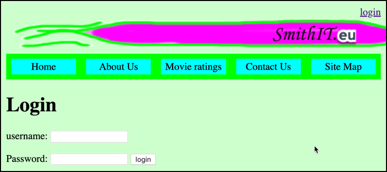
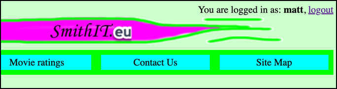
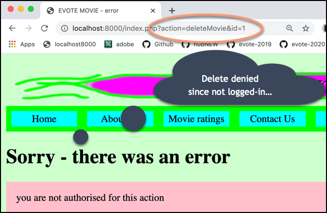

# evote-movie-2020-13-login-security

We need to secure the CREATE-UPDATE-DELETE actions against non-logged-in users. So we'll create a login form and add SESSION based security.







- create a login form template `/templates/loginForm.html.twig`:

    ```twig
    
    
    home page
    
    
    
        <h1>Login</h1>
    
        <form
                method="post"
                action="index.php"
        >
            <input type="hidden" name="action" value="processLogin">
    
            username:
            <input name="username">
            <p>
                Password:
                <input name="password">
                <input type="submit" value="login">
        </form>
    
    ```

- create a `LoginController` class with a method to display the login form:
    
    ```php
    <?php
    namespace Tudublin;
        
    class LoginController extends Controller
    {
        public function loginForm()
        {
            $template = 'loginForm.html.twig';
            $args = [];
            $html = $this->twig->render($template, $args);
            print $html;
        }
    }
    ```
  
- add a `WebApplication` switch case to show this form:
    
    ```php
    class WebApplication
    {
        public function run()
        {
            $action = filter_input(INPUT_GET, 'action');
            if(empty($action)){
                $action = filter_input(INPUT_POST, 'action');
            }
            $mainController = new MainController();
            $movieController = new MovieController();
            $loginController = new LoginController();
    
            switch ($action) {
                case 'login':
                    $loginController->loginForm();
                    break;
                    
                case 'processEditMovie':
                    $movieController->processUpdateMovie();
                    break;
    ```
  
- we'll also add to `WebApplication` a case for when the action is `processLogin`:

    ```php
    switch ($action) {
        case 'processLogin':
            $loginController->processLogin();
            break;
    
        case 'login':
            $loginController->loginForm();
            break;
    ```
  
- let's write our method to process the submission of `username` and `password` from the login form. Here is the `processLogin()` method of our new `LoginController` class:

    ```php
    public function processLogin()
    {
        $username = filter_input(INPUT_POST, 'username');
        $password = filter_input(INPUT_POST, 'password');
    
        $isValidLogin = $this->checkCredentials($username, $password);
    
        if($isValidLogin){
            // store value in session ...
            $_SESSION['username'] = $username;
            $mainController = new MainController();
            $mainController->home();
        } else {
            $movieController = new MovieController();
            $movieController->error('bad username or password');
        }
    }
    ```
  
    - we retrieve the `username` and `password` from the form
    - we test these values with method `checkCredentials(...)` (which we'll write next ...)
    - if valid, we store the `username` in the SESSION, and goto the home page
    - ELSE (if not valid credentials) we display an error page to the user
    
- all that is left is to write the method `checkCredentials(...)` in our `LoginController` class. For now we can simply hard-code valid username/password pairs as follows:

    ```php
    public function checkCredentials($username, $password)
    {
        if('matt' == $username && 'smith' == $password){
            return true;
        }
    
        if('admin' == $username && 'admin' == $password){
            return true;
        }
    
        return false;
    }
    ```
  
- since we are working with SESSIONS, we must add the `start_session()` statement at the top of our `/public/index.php` root website script:
    
    ```php
    <?php
    session_start();
    
    require_once __DIR__ . '/../config/dbConstants.php';
    require_once __DIR__ . '/../vendor/autoload.php';
    
    use Tudublin\WebApplication;
    
    $app = new WebApplication();
    $app->run();
    ```
  
- also, since we are working with sessions, we may want to access session values from Twig. We can do this easily by adding the `$_SESSION` array as a globally accessible Twig variable to all templates. This is a one-liner in our `Controller` superclass:

    ```php
    <?php
    namespace Tudublin;
    
    class Controller
    {
        const PATH_TO_TEMPLATES = __DIR__ . '/../templates';
        protected $twig;
    
        public function __construct()
        {
            $this->twig = new \Twig\Environment(new \Twig\Loader\FilesystemLoader(self::PATH_TO_TEMPLATES));
            $this->twig->addGlobal('session', $_SESSION);
        }
    }
    ```

- we can now add code in our base Twig template, to offer a login link if there is no username in the sesion, but if there is a username in the session we offer a logout link and display the username of the current user:

```twig
<div id="login">
    

        You are logged in as: <b>{{ session.username }}</b>,
        <a href="/index.php?action=logout">logout</a>

    

        <a href="/index.php?action=login">login</a>

    
</div>
```

- we can also define some CSS to make the login content right-aligned:

    ```css
    #login {
        text-align: right;
    }
    ```

- let's define a `logout()` method in our `LoginController` which empties the `$_SESSION` array:
    
    ```php
    public function logout()
    {
        $_SESSION = [];
        $mainController = new MainController();
        $mainController->home();
    }
    ```
  
- let's add a switch case to the `WebApplication` front controller that executes the logout method when the action is `logout`:
    
    ```php
    switch ($action) {
        case 'processLogin':
            $loginController->processLogin();
            break;
    
        case 'logout':
            $loginController->logout();
            break;
    
        case 'login':
            $loginController->loginForm();
            break;
    ```
  
- with login/logout working, we can now hide the CREATE/UPDATE/DELETE = C(R)UD links in the list of movies (`/templates/list.html.twig`), so they are only shown when a user is logged-in:

    ```twig
    <table>
        <tr>
            <th> ID </th>
            <th> title </th>
            <th> category </th>
            <th> price </th>
            <th> vote average </th>
            <th> num votes </th>
            <th> stars </th>
            
            
                <th> (EDIT) </th>
                <th> (DELETE) </th>
            
        </tr>
    
        
        <tr>
            <td>{{ movie.id }}</td>
            <td>{{ movie.title }}</td>
            <td>{{ movie.category }}</td>
            <td>&euro; {{ movie.price | number_format(2, '.', ',') }}</td>
            <td>{{ movie.voteAverage }} %</td>
            <td>{{ movie.numVotes }}</td>
            <td>
                
                    
                
                    (no votes yet)
                
            </td>
            
            
                <td>
                    <a href="/index.php?action=editMovie&id={{ movie.id }}">
                        EDIT
                    </a>
                </td>
                <td>
                    <a href="/index.php?action=deleteMovie&id={{ movie.id }}">
                        DELETE
                    </a>
                </td>
            
        </tr>
        
    
    </table>
  
    
        <a href="/index.php?action=newMovieForm">CREATE a new movie</a>
    

    ```
  
- finally, we need to PROTECT the C(R)UD actions, as well as hiding the links. We do this by testing in our `WebApplication` Front Controller whether the user is logged in before we invoke one of these C(R)UD actions. If they are not logged in then an error page is displayed:

    ```
    case 'processEditMovie':
        if($loginController->isLoggedIn()){
            $movieController->processUpdateMovie();
        } else {
            $movieController->error('you are not authorised for this action');
        }
        break;
    
    case 'processNewMovie':
        if($loginController->isLoggedIn()){
            $movieController->processNewMovie();
        } else {
            $movieController->error('you are not authorised for this action');
        }
        break;
    
    case 'deleteMovie':
        if($loginController->isLoggedIn()){
            $movieController->delete();
        } else {
            $movieController->error('you are not authorised for this action');
        }
        break;
    ```
  
- all we need to do now is add that method `isLoggedIn()` to our `LoginController`:

    ```php
    public function isLoggedIn()
    {
        if(isset($_SESSION['username'])){
            return true;
        }
    
        return false;
    }
    ```
  
    - this method returns TRUE if an element is found in the SESSION array for key `username`, and FALSE otherwise ...
  


